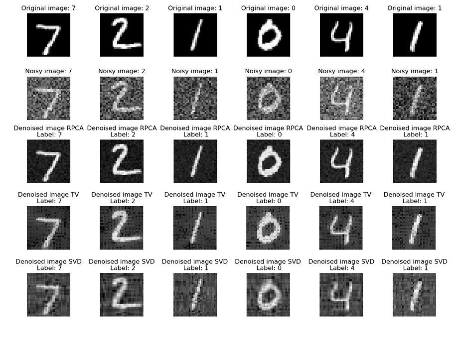

## Image denoising techniques and their applications for CNNs

This study examines the effectiveness of three different image denoising techniques—Singular Value Decomposition (SVD), Total Variation (TV) inpainting, and Robust Principal Component Analysis (RPCA)—in improving Convolutional Neural Network (CNN) accuracy on the MNIST dataset. The research applies these denoising methods to enhance the quality of input data for CNNs, with a focus on understanding their individual contributions to accuracy improvement.

Experimental results show that among the considered techniques, RPCA consistently outperforms SVD and TV inpainting in reducing image noise while preserving essential features. This underscores the robustness of RPCA in effectively separating clean signal from noise components, resulting in superior denoising outcomes. Subsequently, the denoised images are used as input data for CNNs, and their impact on accuracy is evaluated.

Furthermore, the study explores the collaborative use of CNNs and RPCA (CCNS) to understand their combined influence on enhancing the accuracy of the MNIST dataset. The results demonstrate that integrating RPCA significantly improves the performance of CNNs, validating its potential as a powerful preprocessing step for accuracy enhancement in the presence of noise. The synergy between RPCA and CNNs is particularly evident, highlighting the complementary nature of these techniques in mitigating the adverse effects of noise on image classification tasks.

### Comparison of Denoising Techniques:

This repository is bulit on [**Robust PCA repository**](https://github.com/sverdoot/robust-pca) .For further details, read the [CMSE831_PRJ](./CMSE831_PRJ.pdf) file.